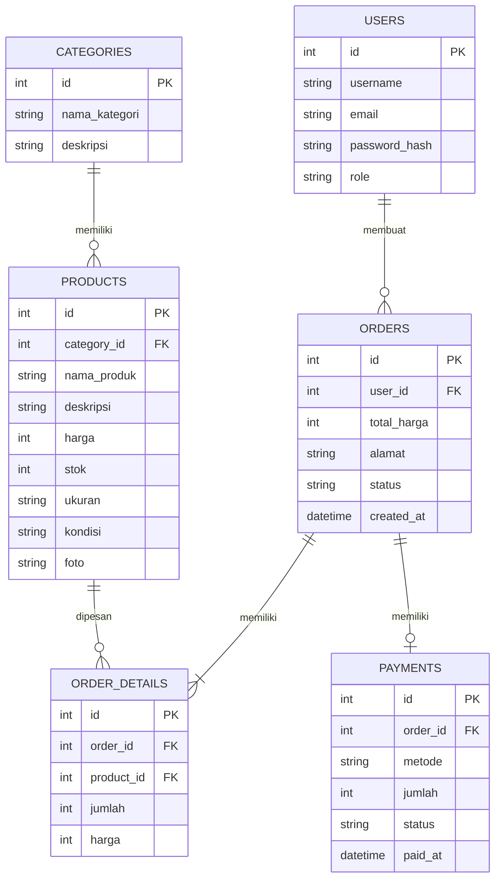

# ERD — ClosetGirls TriftShop

## 1. Entity Relationship Diagram



## 2. Penjelasan Entitas

| Entitas           | Fungsi                                                                                   |
| ----------------- | ---------------------------------------------------------------------------------------- |
| **USERS**         | Menyimpan data pengguna dan admin.                                                       |
| **CATEGORIES**    | Menyimpan kategori produk thrift seperti atasan, bawahan, outer, dan lainnya.            |
| **PRODUCTS**      | Menyimpan data produk yang dijual, seperti nama, harga, ukuran, kondisi, stok, dan foto. |
| **ORDERS**        | Menyimpan data pesanan yang dibuat oleh pengguna.                                        |
| **ORDER_DETAILS** | Menyimpan rincian produk dalam setiap pesanan.                                           |
| **PAYMENTS**      | Menyimpan informasi pembayaran dari pesanan.                                             |

## 3. Relasi Antar Entitas

| Relasi                       | Keterangan                                               |
| ---------------------------- | -------------------------------------------------------- |
| **USERS → ORDERS**           | Satu pengguna dapat membuat banyak pesanan.              |
| **CATEGORIES → PRODUCTS**    | Satu kategori dapat memiliki banyak produk.              |
| **ORDERS → ORDER_DETAILS**   | Satu pesanan memiliki satu atau lebih detail produk.     |
| **PRODUCTS → ORDER_DETAILS** | Satu produk dapat terdapat pada beberapa detail pesanan. |
| **ORDERS → PAYMENTS**        | Satu pesanan memiliki informasi pembayaran.              |

## 4. Struktur Database

```text
USERS
  │
  │ membuat
  ↓
ORDERS ───────────→ PAYMENTS
  │
  │ memiliki
  ↓
ORDER_DETAILS
  ↑
  │ dipesan
  │
PRODUCTS
  ↑
  │ memiliki
  │
CATEGORIES
```
