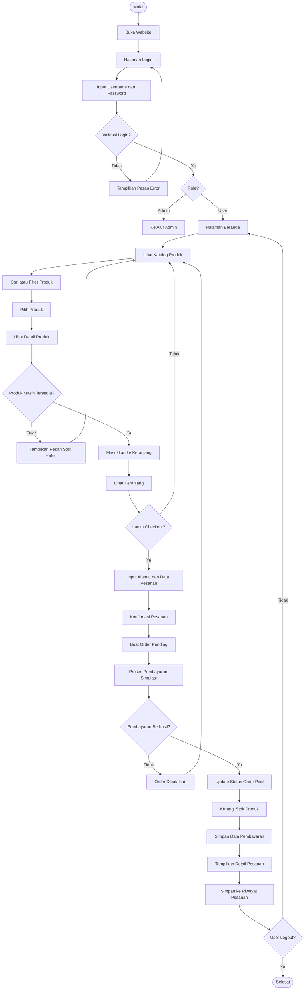
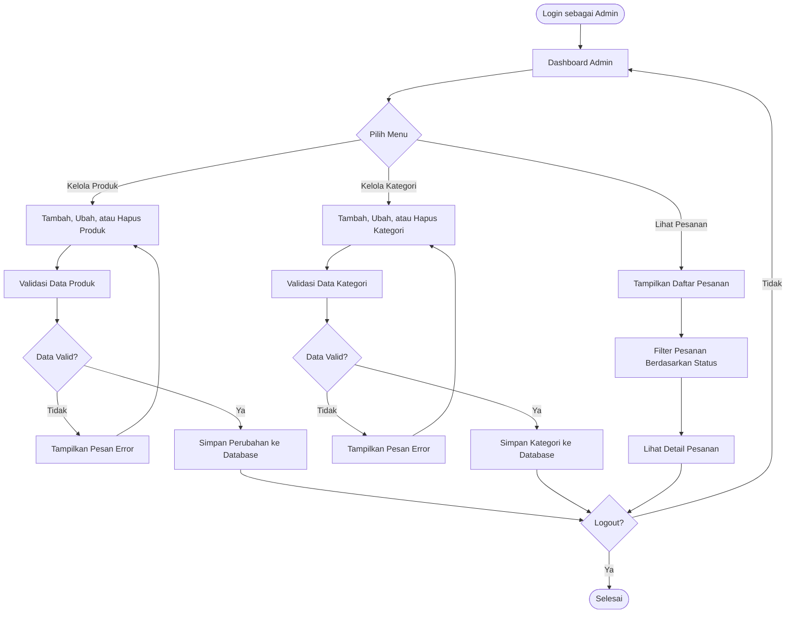
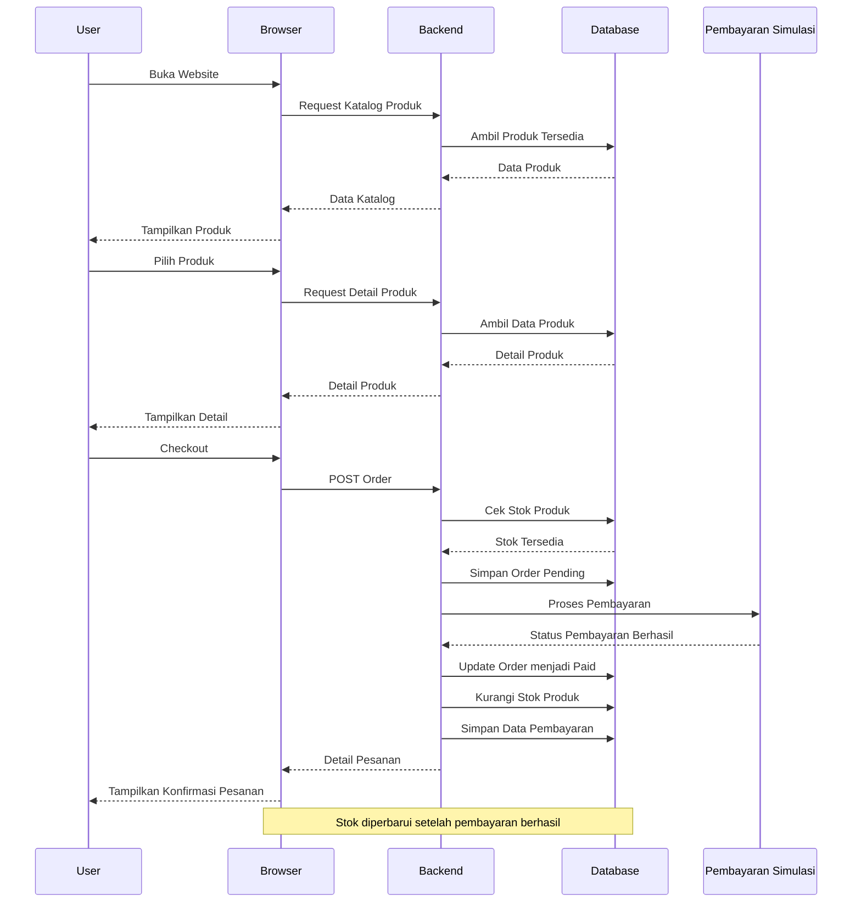

# FLOWCHART APLIKASI — ClosetGirls TriftShop

## Alur Utama Sistem (Pembeli)

---

# Alur Admin

---

# Penjelasan Alur

1. **Mulai** — User atau admin membuka website ClosetGirls TriftShop.
2. **Login** — Pengguna memasukkan username dan password.
3. **Validasi Login** — Sistem memeriksa data login. Jika salah, pengguna kembali ke halaman login.
4. **Cek Role** — Sistem membedakan pengguna sebagai **User** atau **Admin**.
5. **Katalog Produk** — User dapat melihat berbagai produk thrift yang tersedia.
6. **Cari dan Filter** — User dapat mencari atau memfilter produk berdasarkan kategori maupun informasi produk.
7. **Detail Produk** — User melihat informasi produk seperti nama, harga, ukuran, kondisi, stok, dan foto.
8. **Cek Ketersediaan** — Sistem memastikan produk masih tersedia sebelum dimasukkan ke keranjang.
9. **Keranjang** — Produk yang dipilih masuk ke keranjang sebelum melakukan checkout.
10. **Checkout** — User mengisi alamat dan melakukan konfirmasi pesanan.
11. **Order Pending** — Sistem membuat pesanan dengan status `pending`.
12. **Pembayaran** — Sistem menjalankan proses pembayaran secara simulasi.
13. **Pembayaran Berhasil** — Jika berhasil, status order berubah menjadi `paid`.
14. **Update Stok** — Stok produk dikurangi setelah pembayaran berhasil.
15. **Riwayat Pesanan** — Data transaksi disimpan sehingga user dapat melihat riwayat pesanannya.
16. **Alur Admin** — Admin dapat mengelola produk, kategori, dan melihat pesanan.
17. **Logout** — Sistem kembali selesai ketika user atau admin melakukan logout.

---

# Diagram Alur Data

Ini aku sesuaikan juga dengan **arsitektur yang tadi**, jadi bukan lagi Flask khusus toko akun game, tetapi sistem ClosetGirls:

