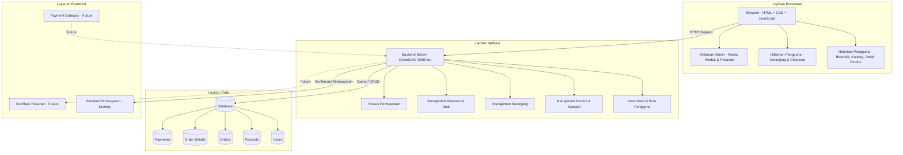
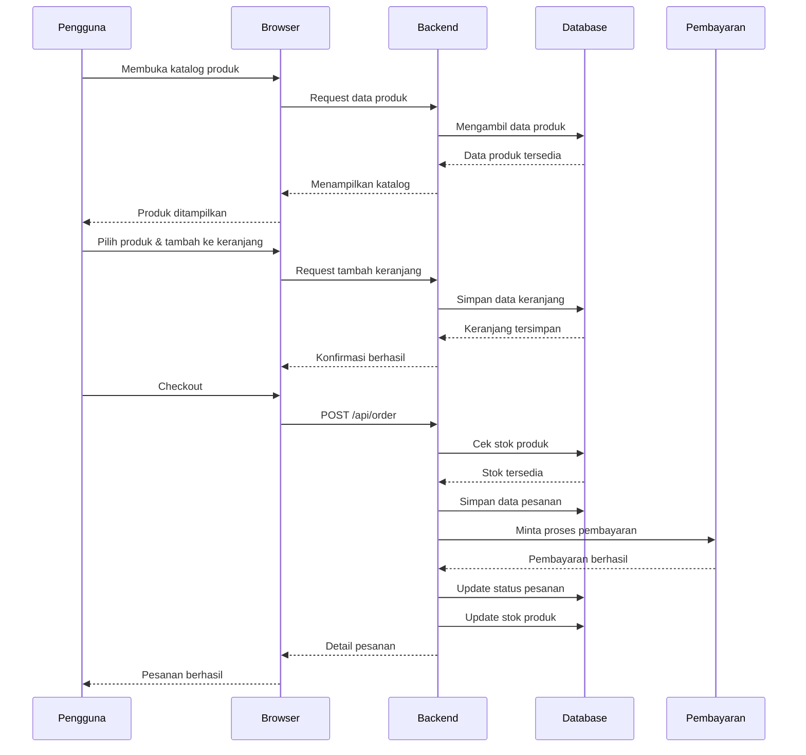
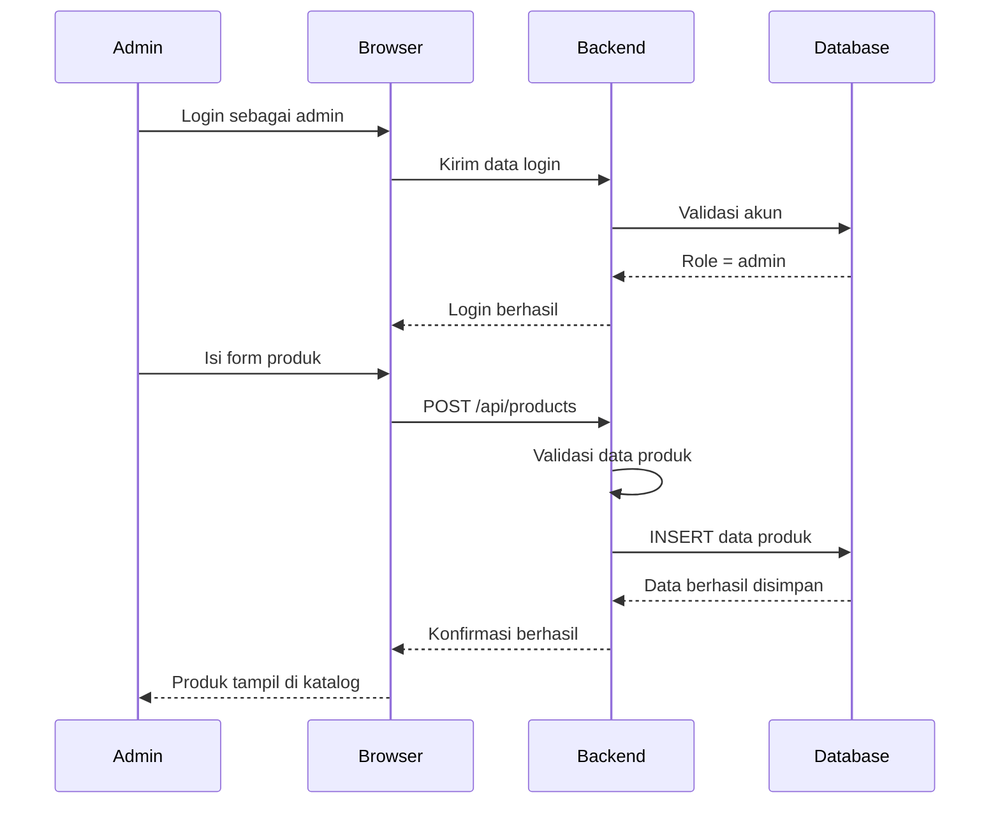
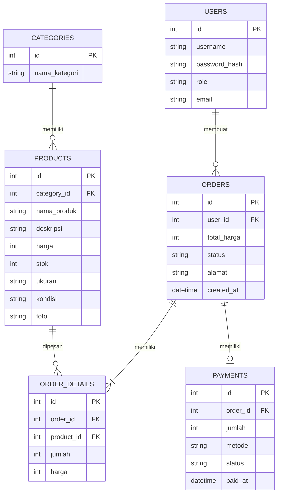

# ARSITEKTUR SISTEM — ClosetGirls TriftShop

## 1. Diagram Arsitektur



---

# 2. Penjelasan Layer

| Layer                 | Komponen                              | Fungsi                                                                                                                |
| --------------------- | ------------------------------------- | --------------------------------------------------------------------------------------------------------------------- |
| **Presentasi**        | HTML, CSS, JavaScript                 | Menampilkan halaman website seperti beranda, katalog produk, detail produk, keranjang, checkout, dan dashboard admin. |
| **Aplikasi**          | Backend Sistem                        | Memproses request pengguna, autentikasi, pengelolaan produk, keranjang, pesanan, stok, dan pembayaran.                |
| **Data**              | Database                              | Menyimpan data pengguna, produk thrift, kategori, pesanan, detail pesanan, dan pembayaran.                            |
| **Layanan Eksternal** | Simulasi Pembayaran / Payment Gateway | Digunakan untuk proses dan konfirmasi pembayaran. Payment gateway dapat dikembangkan pada tahap berikutnya.           |

### Gambaran sederhananya:

```text
        PENGGUNA / ADMIN
               ↓
          WEBSITE
       (HTML, CSS, JS)
               ↓
           BACKEND
               ↓
           DATABASE
               ↓
      Data Produk & Pesanan
               ↓
     SIMULASI PEMBAYARAN
```

Jadi pengguna **tidak langsung mengakses database**. Semua permintaan diproses terlebih dahulu oleh sistem/backend.

---

# 3. Alur Komunikasi

## 3.1 Alur Pembelian Produk



---

## 3.2 Alur Admin Menambah Produk



---

# 4. Rancangan Tabel Database



### Penjelasan singkat database

* **USERS** → menyimpan data akun pengguna dan admin.
* **CATEGORIES** → menyimpan kategori pakaian/produk thrift.
* **PRODUCTS** → menyimpan informasi produk yang dijual.
* **ORDERS** → menyimpan data pesanan pengguna.
* **ORDER_DETAILS** → menyimpan rincian produk yang ada dalam pesanan.
* **PAYMENTS** → menyimpan informasi pembayaran.

---

# 5. Teknologi yang Digunakan

| Komponen            | Teknologi                | Alasan                                                              |
| ------------------- | ------------------------ | ------------------------------------------------------------------- |
| **Frontend**        | HTML + CSS + JavaScript  | Digunakan untuk membangun tampilan dan interaksi website.           |
| **Backend**         | Python + Flask           | Digunakan untuk menangani request dan logika sistem.                |
| **Database**        | SQLite                   | Ringan dan mudah digunakan untuk project skala kecil/menengah.      |
| **Keamanan**        | Password Hashing         | Password pengguna tidak disimpan dalam bentuk teks biasa.           |
| **Pembayaran**      | Simulasi / Dummy Payment | Memudahkan proses demonstrasi tanpa membutuhkan akun merchant asli. |
| **Version Control** | Git + GitHub             | Digunakan untuk menyimpan dan mengelola source code project.        |
| **Diagram**         | Mermaid                  | Digunakan untuk membuat diagram arsitektur, sequence, dan ERD.      |
| **Desain UI/UX**    | Figma                    | Digunakan untuk membuat rancangan antarmuka website.                |

---

# 6. Kelebihan Arsitektur Ini

* **Modular** — setiap bagian sistem memiliki fungsi yang berbeda sehingga lebih mudah dikembangkan.
* **Sederhana** — menggunakan teknologi yang relatif ringan dan sesuai untuk project mahasiswa.
* **Terstruktur** — frontend, backend, dan database memiliki pembagian tugas yang jelas.
* **Mudah dikembangkan** — sistem dapat ditambahkan fitur seperti payment gateway dan notifikasi pada tahap berikutnya.
* **Mudah dikelola** — admin dapat mengelola produk, stok, dan pesanan melalui sistem.
* **Lebih aman** — terdapat autentikasi pengguna dan pembagian role antara pengguna dan admin.
* **Mendukung pengembangan bertahap** — fitur dasar dapat dibuat terlebih dahulu kemudian dikembangkan sesuai kebutuhan.

---
