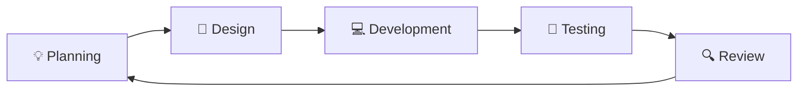
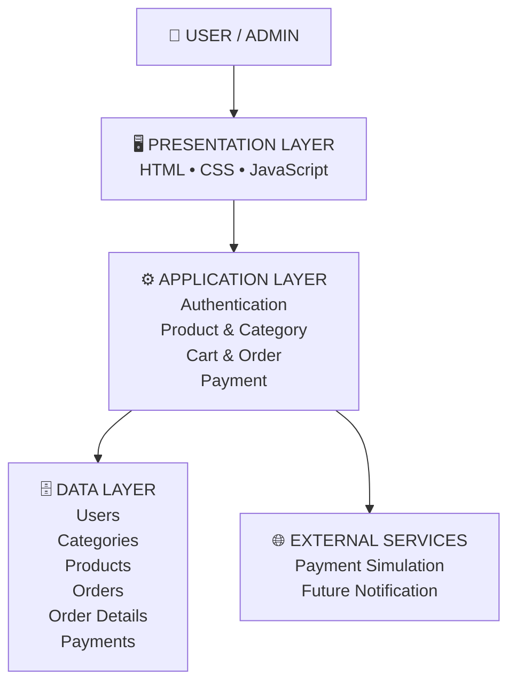
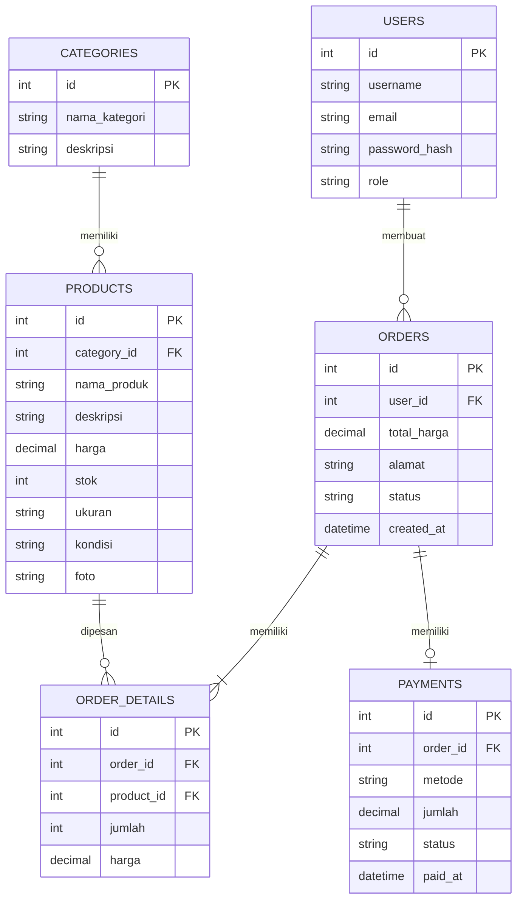
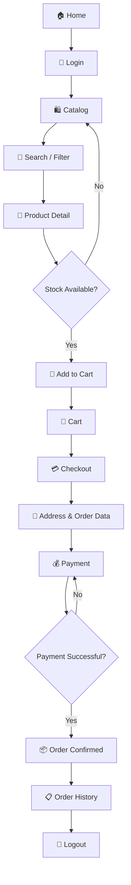
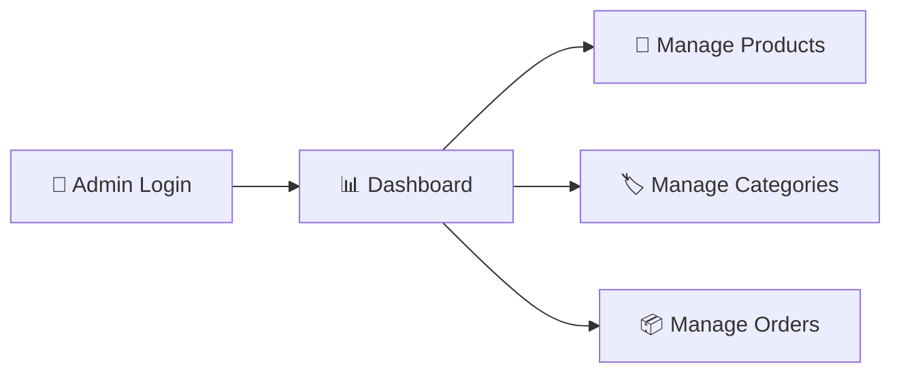
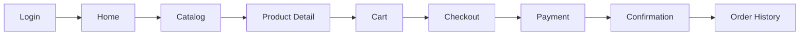
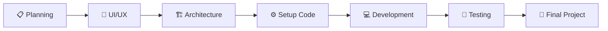

````markdown
<!-- ========================================================= -->
<!--                 CLOSETGIRLS TRIFTSHOP                    -->
<!-- ========================================================= -->

<div align="center">


<br>


</div>

---

# 👗 WELCOME TO OUR CLOSET

> **ClosetGirls TriftShop** adalah konsep toko thrift fashion online
> yang membantu pengguna menemukan pakaian pre-loved dengan mudah,
> mulai dari melihat produk, memilih barang, memasukkan ke keranjang,
> melakukan checkout, hingga melihat riwayat pesanan.

### ✨ Our Concept

ClosetGirls membawa konsep **digital closet** sebagai tempat untuk
menjelajahi berbagai pilihan fashion thrift dalam satu platform.

```text
        ┌───────────────────────────┐
        │     👗 DIGITAL CLOSET     │
        └─────────────┬─────────────┘
                      │
              ┌───────▼───────┐
              │  Browse Style │
              └───────┬───────┘
                      │
              ┌───────▼───────┐
              │ Choose Pieces │
              └───────┬───────┘
                      │
              ┌───────▼───────┐
              │ Add to Cart   │
              └───────┬───────┘
                      │
              ┌───────▼───────┐
              │   Checkout    │
              └───────┬───────┘
                      │
              ┌───────▼───────┐
              │  New Story ✨ │
              └───────────────┘
````

---

# 🌷 THE GIRLS BEHIND THE CLOSET

<div align="center">

| 👩🏻   | Member    | Contribution                          |
| ---- | --------- | --------------------------------     |
| 🎀   | **Dinar** | Project Chapter & Function Point     |
| 👜   | **Anisa** | Flowchart                            |
| 👗   | **Aisy**  | UI/UX Design,ERD,Arsitektur & Dokumen|

</div>

> *Three girls, one closet, one project.*

---

# 🛍️ ABOUT THE PROJECT

### What is ClosetGirls?

ClosetGirls TriftShop merupakan rancangan sistem toko thrift
fashion online yang dibuat untuk mempermudah pengguna dalam
mencari dan membeli produk fashion pre-loved.

### 🎯 Project Goals

* 🛍️ Menampilkan katalog produk thrift
* 🔎 Mempermudah pencarian dan filter produk
* 👗 Menampilkan detail produk
* 🛒 Menyediakan keranjang belanja
* 💳 Menyediakan proses checkout dan pembayaran
* 📦 Menyimpan informasi pesanan
* 👩🏻‍💻 Membantu admin mengelola produk dan pesanan

---

# 🧩 PROJECT STRUCTURE

```text
ClosetGirls-TriftShop/
│
├── README.md
│
├── agile_methodology/
│
├── project_chapter/
│
├── function_point/
│
├── flowchart/
│
├── erd/
│
├── architecture/
│
├── ui_ux/
│
└── setup_code/
```

---

# 🔄 AGILE METHODOLOGY

ClosetGirls menggunakan pendekatan **Agile** untuk membantu
pengembangan project dilakukan secara bertahap.



### Sprint Flow

```text
Planning
   ↓
Design
   ↓
Development
   ↓
Testing
   ↓
Review
   ↓
Improvement
   ↺
```

---

# 🏗️ SYSTEM ARCHITECTURE



### Architecture Layers

| Layer            | Function                                      |
| ---------------- | --------------------------------------------- |
| 🖥️ Presentation | Tampilan yang digunakan user dan admin        |
| ⚙️ Application   | Menjalankan logika utama sistem               |
| 🗄️ Data         | Menyimpan data pengguna, produk dan transaksi |
| 🌐 External      | Terhubung dengan layanan eksternal            |

---

# 🗃️ DATABASE / ERD



---

# 🛒 MAIN USER FLOW



---

# 👩🏻‍💻 ADMIN FLOW



---

# 🎨 UX/UI DESIGN

### User Journey



### Main Screens

| Screen             | Description                 |
| ------------------ | --------------------------- |
| 🔐 Login           | Halaman masuk pengguna      |
| 🏠 Home            | Halaman utama toko          |
| 🛍️ Catalog        | Daftar produk thrift        |
| 👗 Product Detail  | Informasi lengkap produk    |
| 🛒 Cart            | Produk yang dipilih         |
| 💳 Checkout        | Data pesanan dan pembayaran |
| 📦 Order History   | Riwayat pesanan             |
| 📊 Admin Dashboard | Pengelolaan sistem          |

---

# 🎀 DESIGN THEME

### Color Palette

| Color         | Hex       | Usage      |
| ------------- | --------- | ---------- |
| 🌸 Dusty Pink | `#D88C9A` | Primary    |
| 🤍 Cream      | `#F8F1E7` | Background |
| 🤎 Dark Brown | `#3E302B` | Text       |
| 🟢 Green      | `#28A745` | Success    |
| 🟡 Yellow     | `#FFC107` | Warning    |
| 🔴 Red        | `#DC3545` | Error      |

### Design Direction

```text
        ┌──────────────────────────┐
        │       CLOSETGIRLS        │
        │                          │
        │    👗  👜  👚  👖       │
        │                          │
        │   Search your style...   │
        │                          │
        │  [ Vintage ] [ Casual ]  │
        │                          │
        │   🛍️ Explore the Closet  │
        └──────────────────────────┘
```

---

# 🧰 CLOSET TOOLKIT

### Frontend


### Backend


### Database


### Design & Documentation


---

# ✨ MAIN FEATURES

```text
┌─────────────────────────────────────────────┐
│              CLOSETGIRLS FEATURES           │
├─────────────────────────────────────────────┤
│                                             │
│  🔐 Authentication                          │
│  🛍️ Product Catalog                         │
│  🔎 Search & Filter                          │
│  👗 Product Detail                           │
│  🛒 Shopping Cart                            │
│  💳 Checkout & Payment                       │
│  📦 Order Management                         │
│  📋 Order History                            │
│  👩🏻‍💻 Admin Dashboard                        │
│                                             │
└─────────────────────────────────────────────┘
```

---

# 📚 PROJECT DOCUMENTATION

| Documentation      | Status         |
| ------------------ | -------------- |
| 📖 Project Chapter | ✅ Available    |
| 📊 Function Point  | ✅ Available    |
| 🔄 Flowchart       | ✅ Available    |
| 🗃️ ERD            | ✅ Available    |
| 🏗️ Architecture   | ✅ Available    |
| 🎨 UX/UI           | ✅ Available    |
| ⚙️ Setup Code      | ✅ Available    |
| 💻 Implementation  | 🚧 Development |

---

# 🌱 PROJECT PROGRESS

```text
Project Chapter      ████████████████████ 100%
Function Point       ████████████████████ 100%
Flowchart            ████████████████████ 100%
ERD                  ████████████████████ 100%
Architecture         ████████████████████ 100%
UX/UI                ████████████████████ 100%
Setup Code            ████████████████████ 100%
Implementation        ████░░░░░░░░░░░░░░░░ 20%
Testing               ░░░░░░░░░░░░░░░░░░░░ 0%
```

---

# 🧵 DEVELOPMENT ROADMAP



---

# 📌 CLOSET RULES

> 👗 Every piece has a story.

> 🛍️ Keep the closet organized.

> ✨ Make the interface simple and comfortable.

> 🧵 Build step by step.

> 💻 Document every progress.

---

# 💭 OUR PROJECT IDEA

ClosetGirls TriftShop dibuat dengan konsep sederhana:

```text
       PRE-LOVED FASHION
              ↓
       DIGITAL CLOSET
              ↓
        EASY BROWSING
              ↓
       EASY SHOPPING
              ↓
       NEW OWNER ✨
```

Kami ingin membuat pengalaman belanja thrift
yang sederhana, terorganisir, dan mudah digunakan.

---

# 👩🏻‍💻 THE TEAM

<div align="center">

### 🎀 DINAR

**Project Chapter & Function Point**

### 👜 ANISA

**Flowchart**

### 👗 AISY

**UI/UX Design,ERD,Arsitektur & Dokumen**

</div>

---

# 🌷 CLOSING

<div align="center">


<br><br>


</div>
```
